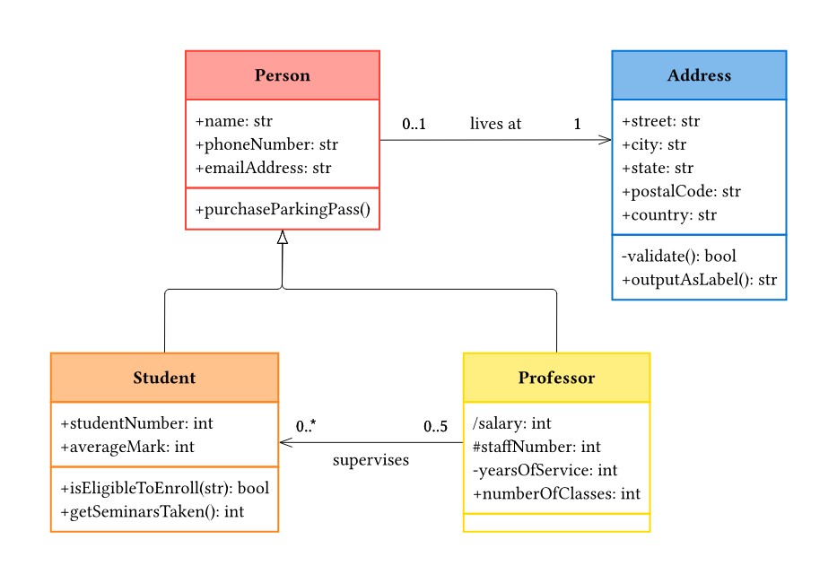

# typst-class-diagram (name pending)

A Typst package to create class diagrams. Built upon [Fletcher](https://typst.app/universe/package/fletcher/)

Will probably create a package out of it later.

## Preview

*Example of a class diagram created with typst-class-diagram. [Original Source](https://www.drawio.com/blog/uml-class-diagrams)*

# Usage

Like in fletcher, you first create a diagram with:
```typ
#import "src/diagram.typ": diagram

#diagram(...)
```
The `diagram` function is equal to fletcher's, so I won't explain it here.

### Class-Nodes

The nodes for classes are created with `class-node`:
```typ
#import "src/class-node.typ": class-node

#class-node(
  label: "Person",
  attributes: (
    "(+-/\#)name: type",
  )
  methods: [
    "(+-/\#)methodName(parameter): returnType",
  ],
)
```
There are also some parameters to customise the appearance of the class-node.\
For more details, see the [`class-node` implementation](src/class-node.typ#L84)
and fletcher's original [node implementation](https://github.com/Jollywatt/typst-fletcher/blob/main/src/node.typ#L221).

### Class-Edges

The edges between the nodes are created with `class-edge`:
```typ
#import "src/class-edge.typ": class-edge

#class-edge(<from>, <to>, arrow: "Inheritance", direction: left, label: "label", mult-left: "0..1", mult-right: "1..*")
```
The edge's design is given with the `arrow` parameter. It takes the name of the relationship as string.\
The `direction` controls the direction of the arrow (<-, ->, <->).

Instead of one label as the original fletcher implementation, there are now six different labels: a centered `label`, a `mult-left` and `mult-right` for multiplicity on the top left and right side of the edge, and a `desc-left` and `desc-right` for description on the bottom left and right side of the edge.\
Each of them is fully controllable like the original label in fletcher by using the [`label-dict`](src/class-edge.typ#L49)).

### Example

An example on how to use this package is given in [example/](example/example.typ).


# Contributing etc.

If you want to contribute, have problems/ideas, or want to insult me,\
feel free to open an issue, start a discussion or contact me directly.